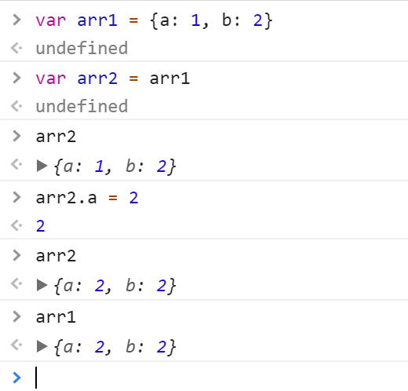

## 献给无法复制的你


> 数组，对象，对象数组，我该那你们怎么办呢？

> 当跳到坑里时，才发现被你的复制给骗了~~~



可以发现对arr2进行修改，arr1也发生了变化，这就是js的浅拷贝模式。

> 对数组，对象，对象数组，进行简单的赋值运算只是创建了一份原有内容的引用，指向的任然是同一块内存区域，修改时会对应修改原内容，而有时候我们的需要独立，彼此互补影响，这就需要对他们进行深拷贝。

- 普通数组
    1. 遍历复制

        ```js
        var arr1 = ["a", "b"], arr2 = [];
        for (var item in arr1) arr2[item] = arr1[item];
        arr2[1] = "c";
        arr1   // => ["a", "b"]
        arr2   // => ["a", "c"]
        ```
        这种方式简单粗暴，考虑到多维数组，可以用递归来实现

        ```js
        function arrDeepCopy(source){
            var sourceCopy = [];
            for (var item in source) {
                sourceCopy[item] = typeof source[item] === "object" ? arrDeepCopy(source[item]) : source[item]
            }
            return sourceCopy;
        }
        ```

    2. slice()

        > arrayObject.slice(start, end)，方法返回一个新的数组，包含从 start 到 end （不包括该元素）的 arrayObject 中的元素。该方法并不会修改数组，而是返回一个子数组。

        ```js
        arr2 = arr1.slice(0);
        arr2[1] = "c";
        arr1   // => ["a", "b"]
        arr2   // => ["a", "c"]
        ```
    3. concat()

        > arrayObject.concat(arrayX,arrayX,......,arrayX), 该方法不会改变现有的数组，而仅仅会返回被连接数组的一个副本。

        ```js
        arr2 = arr1.concat();
        arr2[1] = "c";
        arr1   // => ["a", "b"]
        arr2   // => ["a", "c"]
        ```

- 对象
    1. 浅拷贝

        ```js
        var obj = { "a": 1, "b": 2 };
        ```

        ```js
        var objCopy = obj;
        objCopy.b = 3;
        obj   // => { "a": 1, "b": 3 }
        objCopy   // => { "a": 1, "b": 3 }
        ```
        > 同样，简单的赋值运算只是创建了一份浅拷贝

    2. 深拷贝

        > 而对于对象的深拷贝，没有内置方法可以使用，我们可以自己命名一个函数进行这一操作

        ```js
        var objDeepCopy = function(source){
            var sourceCopy = {};
            for (var item in source) sourceCopy[item] = typeof source[item] === 'object' ? objDeepCopy(source[item]) : source[item];
            return sourceCopy;
        }
        var objCopy = objDeepCopy(obj);
        objCopy.a.a1[1] = "a13";
        obj   // => { "a": { "a1": ["a11", "a12"], "a2": 1 }, "b": 2 }
        objCopy   // => { "a": { "a1": ["a11", "a13"], "a2": 1 }, "b": 2 }
        ```

- 对象数组(复杂型)

    ```js
    var objDeepCopy = function (source) {
        var sourceCopy = source instanceof Array ? [] : {};
        for (var item in source) {
            sourceCopy[item] = typeof source[item] === 'object' ? objDeepCopy(source[item]) : source[item];
        }
        return sourceCopy;
    }
    var objCopy = objDeepCopy(obj);
    objCopy[0].a.a1[1] = "a13";
    objCopy[1][1].e = "6";
    obj   // => [{ "a": { "a1": ["a11", "a12"], "a2": 1 }, "b": 2 }, ["c", { "d": 4, "e": 5 }]]
    objCopy   // => [{ "a": { "a1": ["a11", "a13"], "a2": 1 }, "b": 2 }, ["c", { "d": 4, "e": 6 }]]
    ```

- 日常用的库函数

    - Object.assign()

    - _clone

    - extends
