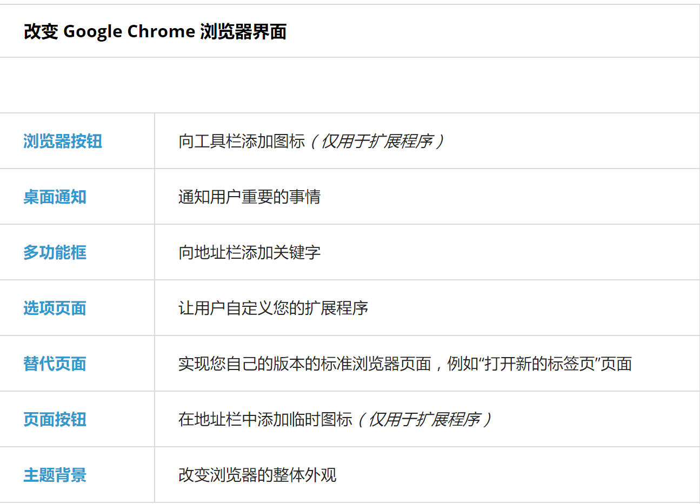
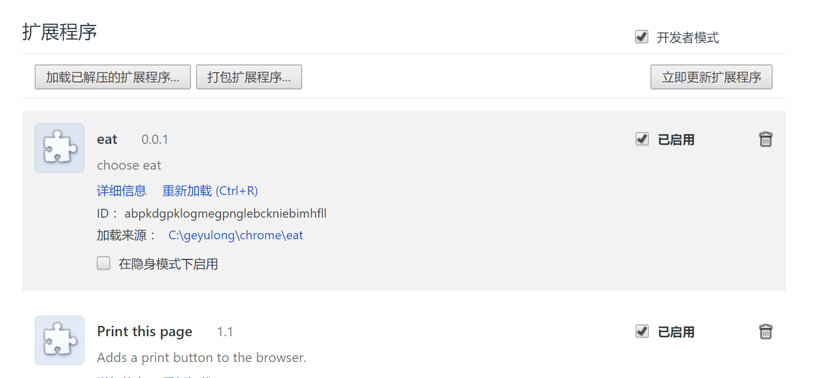
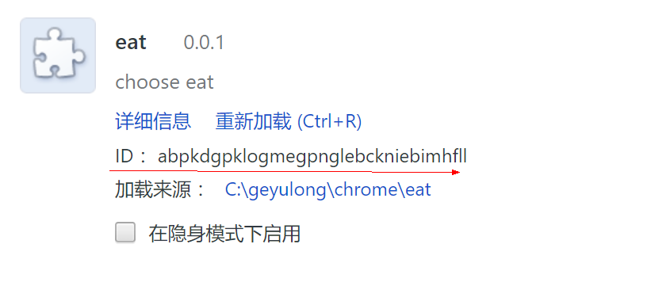
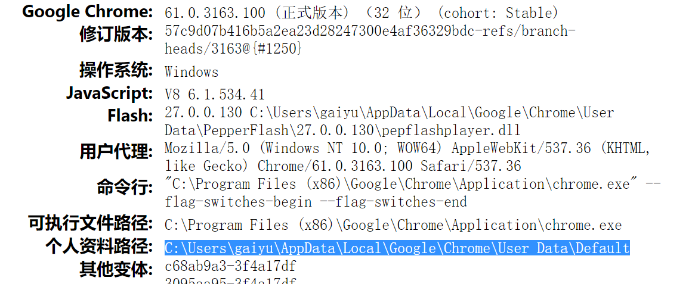

## Chrome插件开发

> 扩展程序由一些文件（包括 HTML、CSS、JavaScript、图片以及其他任何您需要的文件）经过 zip 打包得到，为 Google Chrome 浏览器增加功能。扩展程序本质上是网页，它们可以利用浏览器为网页提供的所有 API，例如 XMLHttpRequest、JSON、HTML5 等等

 扩展程序可以通过内容脚本或跨站 XMLHttpRequest 与网页或者服务器交互，扩展程序也可以以编程方式与浏览器功能（例如书签和标签页交互）。

#### 扩展程序的界面

> 很多应用会以browser	action或page	action的形式在浏览器界面上展现出 来。每个应用（扩展）最多可以有一个browser action或page action。当应用（扩展）的图标 是否显示出来是取决于单个的页面时，应当选择page action；当其它情况时可以选择browser action。

应用也可以通过其它方式提供界面，比如加入到上下文菜单，提供一个选项页面或者用一个 content	script改变页面的显示等。可以在"开发指南"中找到应用（扩展）特性的完整列表以及 实现的细节

[界面列表](https://crxdoc-zh.appspot.com/extensions/devguide)



- Browser Actions将扩展图标置于Chrome浏览器工具栏中，地址栏的右侧。如果声明了popup页面，当用户点击图标时，在图标的下侧会打开这个页面。同时图标上面还可以附带badge——一个带有显示有限字符空间的区域——用以显示一些有用的信息，如未读邮件数、当前音乐播放时间等。
如果没有足够的空间，会在图标的上侧打开。
- 右键菜单：要在Manifest的permissions域中声明contextMenus权限。
- 桌面提醒：需要在Manifest中声明notifications权限。
创建桌面提醒非常容易，只需指定标题、内容和图片即可。下面的代码生成了标题为“Notification Demo”，内容为“Merry Christmas”，图片为“icon48.png”的桌面提醒窗口。

#### 目录结构

```js
├ demo
    ├ manifest.json //一个清单文件,这是一个配置文件，里面记录了扩展的使用范围、作者、版本、其余需要加载的文件等内容;
    ├ popup.html //一个或多个HTML文件,点击扩展图标，弹出的面板页面（如果在manifest.json中配置了default_popup为该文件的话）
    ├ demo.js //一个或多个js文件,popup面板加载的js脚本文件
    ├ popup.css //popup面板加载的js脚本文件
    ├ ... //需要的任何其他文件,比如图片icon.png
```

 当您编写您的扩展程序时，您将所有这些文件放在一个文件夹中。当您发布您的扩展程序时，该文件夹的内容将被压缩成一个特殊的 ZIP 文件，以 .crx 为后缀。如果您通过 Chrome 开发者信息中心上传您的扩展程序，该 .crx 文件会自动为您创建

> 至于HTML、CSS、JS 及文件组织，跟普通的 Web 开发一样
> 出于安全考虑，入口html文件中的JS代码只能通过script标签引用外部脚本文件，内嵌的JS代码会失效的。

##### manifest.json

> 每一个扩展程序、可安装的网络应用以及主题背景都有一个 JSON 格式的清单文件，名为 manifest.json，提供重要信息,
包含一些属性，如您的扩展程序的名称与描述、它的版本号等等。从更高的层次来看，我们将使用它来向 Chrome 浏览器声明扩展程序将会做什么，以及为了完成这些任务所需要的权限


```js
{
  // Required 必须要求部分

  //manifest 版本从 chrome 18 之后都应该是 2, 此处不需要变化
  "manifest_version": 2,

  //名字是插件主要的 identifier
  "name": "My Extension",

  //插件版本号, string, 最多为4个以 dot 分开的
  //interger, e.g. "3.1.2.4567"
  //版本号不能随意乱写,
  //chrome 的自动更新系统会根据版本号判断是否需要将插件更新至新的版本
  "version": "1.0.3",

  //Recommended

  //如果需要指定不同 locale 使用不同的资源文件,
  //例如在中国显示中文, 在日本显示为日语等
  //则会在根目录中添加 `_locale` 文件夹;
  //若没有 `_locale` 文件夹, 则不能出现该项配置
  "default_locale": "en",

  //描述插件是干啥的,
  //描述需要适合在 chrome web store 上显示
  "description": "A plain text description",

  //图标可以是1个, 或者多个
  //一般来说最好的方案是提供3个:
  //- 128x128: 在从 chrome web store 安装的过程中需要使用,
  //- 48x48: chrome://extensions 插件管理页面中使用
  //- 16x16: 插件页面当做 favicon 使用
  "icons": {
      "16": "icon16.png",
      "48": "icon48.png",
      "128": "icon128.png"
  },

  //Pick one (or none) - browser_action / page_action

  //如果有 browser_action,
  //即在 chrome toolbar 的右边添加了一个 icon
  //参考 https://developer.chrome.com/extensions/browserAction
  "browser_action": {
      //icon 是随意提供多少个,
      //chrome 选取最接近的尺寸, 为了适配不同屏幕,
      //提供多种尺寸是很实用的
      "default_icon": {                    // optional
        "16": "images/icon16.png",           // optional
        "24": "images/icon24.png",           // optional
        "32": "images/icon32.png"            // optional
      },
      //tooltip, 光标停留在 icon 上时显示
      "default_title": "Google Mail",      // optional; shown in tooltip
      //如果有 popup 的页面, 则用户点击图标就会渲染此 HTML 页面
      "default_popup": "popup.html"        // optional        
  },

  //如果并不是对每个网站页面都需要使用插件, 可以使用 page_action 而不是 browser_action
  //browser_action 应用更加广泛
  //如果 page_action 并不应用在当前页面, 会显示灰色
  "page_action": {...},

  //Optional

  "author": ...,
  "automation": ...,

  //参考: https://developer.chrome.com/extensions/background_pages
  //如字面意思, background 即插件后台 process,
  //一般不需要 html, 只需要一个 js 文件, 类似一个监听器
  //如果在 browser_action 或者其他情况下 state 变化,
  //就会告诉 background 来更新 view
  "background": {
    "scripts": ["background.js"],

    //如果有必要, 也可以指定 background HTML
    "page": "background.html",

    //此处设定为 false 为如果这个 process 并没有在运行,
    //即释放内存和系统资源
    "persistent": false //Recommended    
  },

  "background_page": ...,

  "chrome_settings_overrides": {
    "homepage": "http://www.homepage.com",
    "search_provider": {
        "name": "name.__MSG_url_domain__",
        "keyword": "keyword.__MSG_url_domain__",
        "search_url": "http://www.foo.__MSG_url_domain__/s?q={searchTerms}",
        "favicon_url": "http://www.foo.__MSG_url_domain__/favicon.ico",
        "suggest_url": "http://www.foo.__MSG_url_domain__/suggest?q={searchTerms}",
        "instant_url": "http://www.foo.__MSG_url_domain__/instant?q={searchTerms}",
        "image_url": "http://www.foo.__MSG_url_domain__/image?q={searchTerms}",
        "search_url_post_params": "search_lang=__MSG_url_domain__",
        "suggest_url_post_params": "suggest_lang=__MSG_url_domain__",
        "instant_url_post_params": "instant_lang=__MSG_url_domain__",
        "image_url_post_params": "image_lang=__MSG_url_domain__",
        "alternate_urls": [
          "http://www.moo.__MSG_url_domain__/s?q={searchTerms}",
          "http://www.noo.__MSG_url_domain__/s?q={searchTerms}"
        ],
        "encoding": "UTF-8",
        "is_default": true
    },

    //覆盖 chrome 设定, Homepage, Search Provider, and Startup Pages
    "startup_pages": ["http://www.startup.com"]
  },

  "chrome_ui_overrides": {
    //覆盖 bookmark ui 设置, 需要 Chrome Dev Release, 较新的 api 吧
    "bookmarks_ui": {
      //去掉添加书签的快捷键,
      "remove_bookmark_shortcut": true,

      //去掉了地址栏右边的 star button, 可以将 browser_action 的 icon 放在此处
      "remove_button": true
    }
  },

  "chrome_url_overrides": {
    // 替换页面 HTML/CSS/JS, 可以替换的页面:
    // - 书签管理页面 chrome://bookmarks
    // - 浏览历史页: chrome://history
    // - 新标签页: chrome://newtab
    "pageToOverride": "myPage.html"

  },

  // commands API 用来添加快捷键
  // 需要在 background page 上添加监听器绑定 handler
  "commands": {
    "toggle-feature-foo": {
      "suggested_key": {
        "default": "Ctrl+Shift+Y",
        "mac": "Command+Shift+Y"
      },
      "description": "Toggle feature foo",
      // 当 chrome 没有 focus 时也可以生效的快捷键
      // 仅限 Ctrl+Shift+[0..9]
      "global": true

    },
    "_execute_browser_action": {
      "suggested_key": {
        "windows": "Ctrl+Shift+Y",
        "mac": "Command+Shift+Y",
        "chromeos": "Ctrl+Shift+U",
        "linux": "Ctrl+Shift+J"
      }
    },
    "_execute_page_action": {
      "suggested_key": {
        "default": "Ctrl+Shift+E",
        "windows": "Alt+Shift+P",
        "mac": "Alt+Shift+P"
      }
    },
    ...
  },
  "content_capabilities": ...,

  // content_scripts 是在当前网页中插入并执行的脚本, 可以对网页进行各种操作
  // content_scripts 中可以监听插件发来的 message, 并进行某些操作
  // 可以选择是否永远插入, 或者只在一部分网页中 inject
  // content_scripts 执行环境称为 isolated world, 和正常页面中的 JS 不在相同环境中
  //  保证不同 script 不会冲突, 也不会和网页本身冲突
  //  也说明互相无法访问或使用其中的变量或函数
  "content_scripts": [
    {
      "matches": ["http://www.google.com/*"],// 指定那些页面需要 inject
      "css": ["mystyles.css"], // 按照顺序 inject
      "js": ["jquery.js", "myscript.js"], // 按照顺序 inject
      "run_at": "document_idle", // 什么时候 inject js,  "document_start", "document_end", or "document_idle".
    }
  ],

  // https://developer.chrome.com/extensions/contentSecurityPolicy
  "content_security_policy": "policyString",
  "converted_from_user_script": ...,
  "current_locale": ...,

  // 对 DevTools 的扩展, 例如 React, Redux develop tools
  "devtools_page": "devtools.html",

  // 添加规则将某些 JS 事件转为 manifest (?)
  "event_rules": [{...}],
  "externally_connectable": {

    // 指定哪些插件/ app/ 网站可以连接到你的插件上
    // 此处 ids 指允许连接的其他插件 id
    // 注意: 如果不写, 则认为所有其他插件都不能连接
    "ids": [
      "aaaaaaaaaaaaaaaaaaaaaaaaaaaaaaaa",
      "bbbbbbbbbbbbbbbbbbbbbbbbbbbbbbbb",
      ...

      //使用 wildcard "*" 允许所有其他插件连接
      "*"
    ],
    "matches": ["*://*.example.com/*"]
  },

  "file_browser_handlers": [...], // 仅能在 Chrome OS 上使用, 对文件的操作
  "file_system_provider_capabilities": {
    // 仅能在 Chrome OS 上使用, 对文件的操作
    "configurable": true,
    "multiple_mounts": true,
    "source": "network"
  },
  "homepage_url": "http://path/to/homepage",

  // 如果有 shared module, 在提供 shared module 的 extension 中则会有 "export" 项
  "import": [{"id": "aaaaaaaaaaaaaaaaaaaaaaaaaaaaaaaa"}],

  // 隐身模式下, "spanning" -> chrome app, "split" -> ext
  "incognito": "spanning, split, or not_allowed",
  "input_components": ...,
  "key": "publicKey", // 不怎么需要用到了
  "minimum_chrome_version": "versionString", // 与 version 相同

  // 使用 Native Client Module 对网络上某种 MIME 类似资源进行操作,
  // 但貌似 deprecated 了, 往 WebAssembly发展了
  "nacl_modules": [{
    "path": "OpenOfficeViewer.nmf",
    "mime_type": "application/vnd.oasis.opendocument.spreadsheet"
  }],

  "oauth2": ...,
  "offline_enabled": true,

  "omnibox": {
    // 注册一个 keyword显示在 address bar 的前面
    // 当用户在 address bar 中输入 keyword 后, 用户就是和插件在交互了
    "keyword": "aString"
  },
  // 其他需要的 permission,
  // 在使用 chrome.permissions API 时用到, 并非安装插件时需要
  "optional_permissions": ["tabs"],

  // 允许用户进行某些配置来定制插件功能, 并使用 chrome.storage.sync api 来保存设置
  // 新版配置功能 api, 支持 chrome40 以上,
  // 打开 dialogue, 使用 chrome.runtime.openOptionsPage api 打开 option 页面
  "options_page": "options.html",
  "options_ui": {
    "chrome_style": true, //默认使用 Chrome user agent stylesheet
    "page": "options.html",
    "open_in_tab": false // 不建议打开新 tab, 以后会删除此项
  },

  //https://developer.chrome.com/extensions/declare_permissions
  //有很多选择, 书签/右键菜单/剪贴板/cookie/下载/.... 等
  "permissions": ["tabs"],
  "platforms": ...,
  "plugins": [...],

  //要求某些可能需要用户安装某些额外的 tech, 例如 webGL
  "requirements": {
    "3D": {
      "features": ["webgl"]
    }
  },

  //chrome 57 以上不再允许外部 web 内容
  "sandbox": [...],

  //插件名字简写
  "short_name": "Short Name",
  "signature": ...,
  "spellcheck": ...,

  //使用 storage.managed api 的话, 需要一个 schema 文件指定存储字段类型等,
  //类似定义数据库表的 column
  "storage": {
    "managed_schema": "schema.json"
  },
  "system_indicator": ...,

  //text-to-speech(TTS) engine, permission 需要加上 ttsEngine
  "tts_engine": {
    "voices": [
      {
        "voice_name": "Alice",
        "lang": "en-US",
        "gender": "female",
        "event_types": ["start", "marker", "end"]
      },
      {
        "voice_name": "Pat",
        "lang": "en-US",
        "event_types": ["end"]
      }
    ]
  },

  //如果不是通过 chrome web store 自动更新插件
  "update_url": "http://path/to/updateInfo.xml",

  //版本号名称, 如 "1.0 beta", 只是为了展示, 更加描述性
  "version_name": "aString",

  //提供插件pkg中某些资源是当前 web page 可以使用的
  //默认插件中的资源对于网页是 blocked,
  //需要说明哪些是要使用的 图片/图标/css/js 等
  "web_accessible_resources": [...]
}

```

> 上边基本是所有清单文件的属性,我们来详细介绍一下基本的属性和常用的.

##### 基本属性

```shell
# 扩展程序的名称
"name": "我的扩展程序",

# 扩展程序的版本
"version": "版本字符串",

# 第一行声明我们使用清单文件格式的版本 2，必须包含
#（版本 1 是旧的，已弃用，不建议使用）
"manifest_version": 2,
```

> 以上属性为必填

##### 常用属性

```shell
{   
    ...

    #指定扩展的图标放在 Chrome 工具栏中，
    #它定义了扩展图标文件位置（default_icon）、
    #悬浮提示（default_title）
    #点击扩展图标所显示的页面位置（default_popup）
    "browser_action": {
        "default_icon": {
            "19": "images/icon19.png",
            "38": "images/icon38.png"
        },
        "default_title": "stock helper",
        "default_popup": "popup.html"
    }
    ...

    #属性定义了扩展的设置页面，
    #配置后在扩展图标点击右键可以看到 选项 ，点击即打开指定页面。
    #对于没有图标（没有设置 browser_action）的扩展，
    #可以在 chrome://extensions/ 页面找到选项按钮
    "options_page": "options.html"

    ...

    #属性是一个数组，它定义了扩展需要向 Chrome 申请的权限，
    #比如通过 XMLHttpRequest 跨域请求数据、
    #访问浏览器选项卡（tabs）、
    #获取当前活动选项卡（activeTab）、
    #浏览器通知（notifications）、存储（storage）等，
    #可以根据需要添加
    "permissions": [
        "http://hq.sinajs.cn/list=*"
        "tabs",
        "activeTab",
        "notifications",
        "storage"
    ]

    ...

    #可以使扩展常驻后台，
    #比较常用的是指定子属性 scripts，
    #表示在扩展启动时自动创建一个包含所有指定脚本的页面
    "background": {
        "scripts": ["js/background.js"]
    }

    ...

    #属性可以自定义的页面替换 Chrome 相应默认的页面，

	#比如新标签(newtab),
    #书签页面（bookmarks）,
    #和历史记录（history）
    "chrome_url_overrides": {
        "newtab": "tab.html"
    },

    ...
}
```

#### Chrome API

除了web本身的API以外，Chrome插件还支持一些独有的API可供使用

所有的Chrome API都是以chrome对象开头，如：chrome.alarms

- bookmarks 操纵书签的API
- browserAction 获取扩展图标、标题、文字、弹出页等
- commands 给扩展添加快捷键
- contextMenus 添加选项到右键弹出菜单
- cookies 控制cookies
- desktopCapture 捕获屏幕、个人窗口或标签内容
- downloads 下载控制
- events 事件相关API
- extension 获取扩展的各部分，也能与各部分交换信息
- extensionTypes 扩展的类型声明
- gcm 启用google云消息服务，收发消息
- history 历史记录控制
- i18n 多语言国际化支持
- idle 取得机器闲置状态
- management 管理扩展与应用
- notifications 通知控制
- pageAction 具体的页面下控制扩展图标、标题、文字、弹出页等相关内容
- permissions 获取拥有的权限
- power 请求系统常亮
- runtime 获取运行时相关信息，包括后台页、manifest等等
- sessions 查询或恢复浏览会话
- storage 存储相关
- tabs 与标签页交互
- vpnProvider 实现vpn客户端需要使用的东西
- webRequest 拦截、修改、阻塞请求
- windows 创建、修改、重排窗口

#### 扩展调试

> chrome的菜单里打开扩展程序(打开开发者模式)



调试通普通页面一样

##### 如何优雅的调试

右键Chrome工具栏的小图标会弹出一个窗口，选择审查弹出内容即可调试。
> 但是这种方法极度低效，

直接chrome://extensions/找到你插件的ID



然后:

```shell
chrome-extension://<插件ID>/插件入口html文件
```

such as:

```shell
chrome-extension://abpkdgpklogmegpnglebckniebimhfll/popup.html
```

##### 查看其他插件的源码

访问chrome://version 找到Chrome插件安装的本机目录



然后找到extension目录

#### 打包

> 当您为扩展程序打包时，扩展程序将获得唯一的密钥对，扩展程序的标识符基于公钥的散列，私有密钥用来为每一个版本的扩展程序签名，必须严格保护，不能由公众访问。注意千万不要将您的私有密钥包含在扩展程序中！

##### 创建包

- 进入以下URL，打开扩展程序管理页面:
chrome://extensions
- 确保右上角的开发者模式复选框已选中.
- 单击打包扩展程序按钮，出现一个对话框。
- 在扩展程序根目录字段中，指定扩展程序所在文件夹的路径，例如，C:\myext。（忽略其他字段，您第一次为一个扩展程序打包时不需要指定私有密钥文件。）
- 单击打包扩展程序。打包程序将创建两个文件：一个 .crx 文件，是实际的可安装的扩展程序；另一个是 .pem 文件，包含私有密钥。

    > 不要丢失私有密钥！确保 .pem 文件保密，并存放在安全的地方。如果您今后需要做如下事情，您需要这一文件：
    > - 更新扩展程序
    > - 将扩展程序上传至 Chrome 网上应用店

##### 更新包

- 增加 manifest.json 中的版本号。
- 进入如下 URL，打开扩展程序管理页面： chrome://extensions
- 单击打包扩展程序按钮，出现一个对话框。
- 在扩展程序根目录字段中指定扩展程序所在文件夹，例如 C:\myext。
- 在私有密钥文件字段中，指定已生成的用于该扩展程序的 .pem 文件位置，例如 C:\myext.pem。
- 单击打包扩展程序

##### 发布包

- 将您创建 .crx 文件时生成的私有密钥文件重命名为 key.pem。
- 将 key.pem 文件放在您的扩展程序根目录中。
- 将这一目录压缩为 ZIP 文件。
- 使用 Chrome 开发者信息中心上传 ZIP 文件。

##### 命令行中打包

```js
chrome.exe --pack-extension=C:\myext --pack-extension-key=C:\myext.pem
```

- 命令chrome.exe（在 Linux 或 Mac OS X 上为 chrome）
- --pack-extension 指定扩展程序所在文件夹的位置
- --pack-extension-key 指定扩展程序私有密钥文件的位置

##### 压缩包

- windows: Send to > Compressed (zipped) folder
- Mac OS X: control-click myapp and choose Compress "myapp"
- command: zip -r myapp.zip myapp

#### demo

##### 工作目录

```js

```

##### 代码实例

##### 运行

#### 推荐

给大家推荐一下我经常用的插件

- Vimium 像vim一样操作chrome
- Google翻译
- Postman
- React Developer Tools 调试react
- Giliffy 绘制uml图，流程图
