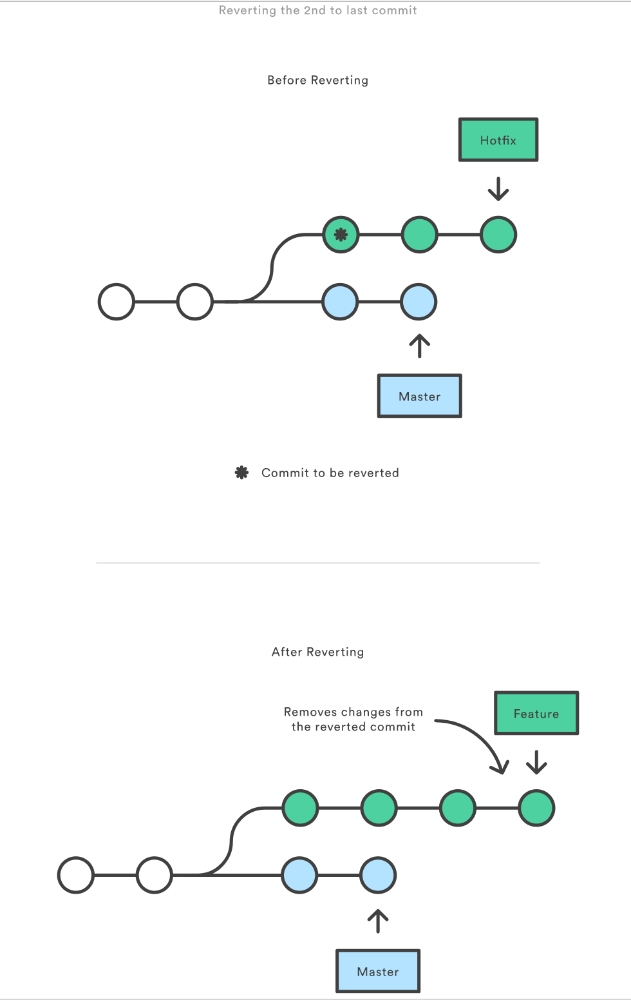
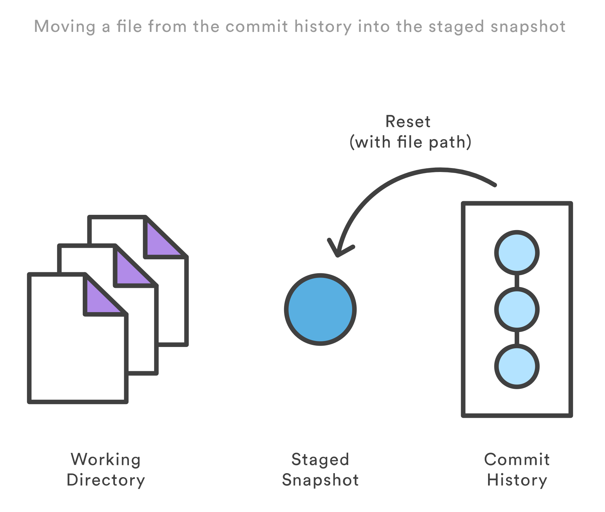

## Git 想滚多远就多远

> 聊一聊Git仓库的代码回滚

> 主要有三个方法：git reset, git checkout, git revert


> Git 仓库有三个主要组成: 工作目录，缓存区和提交历史


### 提交层面的操作

- `git reset` 参数决定了它的作用域，如果没有包含路径，对所有操作都生效
- `git checkout` 同reset
- `git revert` 没有文件层面的操作

----
#### reset

提交层面上，reset将一个分支的末端指向另一个提交。这可以用来移除当前分支的一些提交

```js
git checkout hotfix
git reset HEAD~2 //HEAD~1，HEAD~2 commit number
```

> 让hotfix分支退回了两个提交


这让hotfix分支末端的两个提交现在变成了悬挂提交，下次Git垃圾回收时，这两个提交将被删除

如果你的更改还没有共享给别人，git reset是撤销这些更改的简单方法，就行go-to命令一样。

除了在当前分支上操作，还可以通过传入这些标记来修改你的缓存区或工作目录：

- `--soft` 缓存区和工作目录都不会被改变
- `--mixed` 默认选项，缓存区和你制定的提交同步，但是工作目录不受影响
- `--hard` 缓存区和工作目录都同步到你制定的提交

> 把这些标记想成定义git reset 操作的作用域就容易多了。


> 当你传入HEAD以外的其他提交时要格外小心，reset操作会重写当前分支的历史，正如rebase黄金法则所说的，在公共分支上这样做，可能会引起严重后果。

#### checkout

大家都非常熟悉提交层面的checkout,当传入分支时，可以切换到那个分支。

```js
git checkout hotfix
```

由于切换分支会更新工作目录，所以Git强制你提交或者缓存工作目录的修改。和git reset 不一样，checkout没有移动这些分支。


除了分支之外，你还可以传入提交的引用来checkout到任意的提交。这和checkout到另一个分支是完全一样的,把HEAD移到特定的提交。比如

```js
git checkout HEAD~2
```


这对于快速查看旧版本来说非常有用，但如果你当前的HEAD没有任何分支引用，那么这会造成HEAD的分离。这是非常危险的，如果你接着添加新的提交，然后切换到别的分支后，就没办法回到之前添加的这些提交，所以在分离HEAD添加新的提交的时候，你应该创建一个新的分支。

#### revert

撤销一个提交的同时，会创建一个新的提交。这是一个安全的方法，因为他不会重写提交历史

```js
git checkout hotfix
git revert HEAD~2
```

> 会找到倒数第二个提交，然后来创建一个新的提交来撤销这些修改，然后把这个提交加入项目中



相比较reset，它不会改变现在的提交历史，因此revert可以用在公共分支上，git reset 应该用在私有分支上。

> 你也可以把 git revert 当作撤销已经提交的更改，而 git reset HEAD 用来撤销没有提交的更改

就像 git checkout 一样，git revert 也有可能会重写文件。所当检测到文件路径时，git reset 将缓存区同步到你指定的那个提交。比如，下面这个命令会将倒数第二个提交中的 foo.py 加入到缓存区中，供下一个提交使用。以，Git 会在你执行 revert 之前要求你提交或者缓存你工作目录中的更改

### 文件层面的操作

git reset 和 git checkout 命令也接受文件路径作为参数。这时它的行为就大为不同了。它不会作用于整份提交，参数将它限制于特定文件。

#### reset

当检测到文件路径时，git reset 将缓存区同步到你指定的那个提交。比如，下面这个命令会将倒数第二个提交中的 foo.py 加入到缓存区中，供下一个提交使用。

```js
git reset HEAD~2 index.js
```

和提交层面的 git reset 一样，通常我们使用HEAD而不是某个特定的提交。运行 git reset HEAD index.js 会将当前的 index.js 从缓存区中移除出去，而不会影响工作目录中对 index.js 的更改



> --soft、--mixed 和 --hard 对文件层面的 git reset 毫无作用，因为缓存区中的文件一定会变化，而工作目录中的文件一定不变。

#### checkout

Checkout 一个文件和带文件路径 git reset 非常像，除了它更改的是工作目录而不是缓存区。不像提交层面的 checkout 命令，它不会移动 HEAD引用，也就是你不会切换到别的分支上去


```js
git checkout HEAD~2 index.js
```

和提交层面相同的是，它可以用来检查项目的旧版本，但作用域被限制到了特定文件。

如果你缓存并且提交了 checkout 的文件，它具备将某个文件回撤到之前版本的效果。注意它撤销了这个文件后面所有的更改，而 git revert 命令只撤销某个特定提交的更改。

和 git reset 一样，这个命令通常和 HEAD 一起使用。比如 git checkout HEAD foo.py 等同于舍弃 foo.py 没有缓存的更改。这个行为和 git reset HEAD --hard 很像，但只影响特定文件。

### 总结

| 命令 | 作用域 | 常用场景|
|---|--|--|
| git reset | 提交层面 | 在私有分支上舍弃一些没有提交的更改 |
| git reset | 文件层面 | 将文件从缓存区中移除|
| git checkout | 提交层面 | 切换分支或者查看旧版本|
| git checkout | 文件层面 | 舍去工作目录中的修改 |
| git revert | 提交层面 | 在公共分支上回滚更改|
| git revert | 文件层面 | 无 |

### 参考链接

[git/tutorials/resetting-checking-out-and-reverting](https://www.atlassian.com/git/tutorials/resetting-checking-out-and-reverting)    
