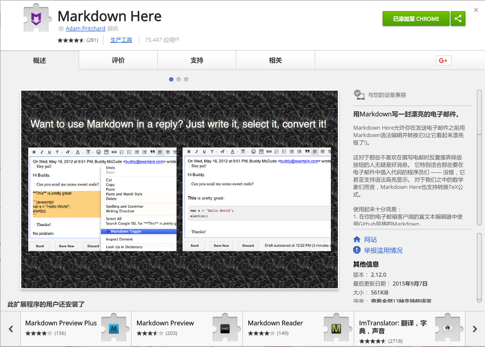
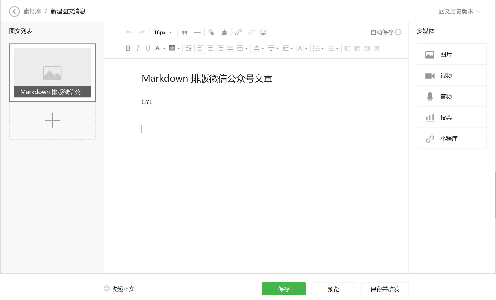
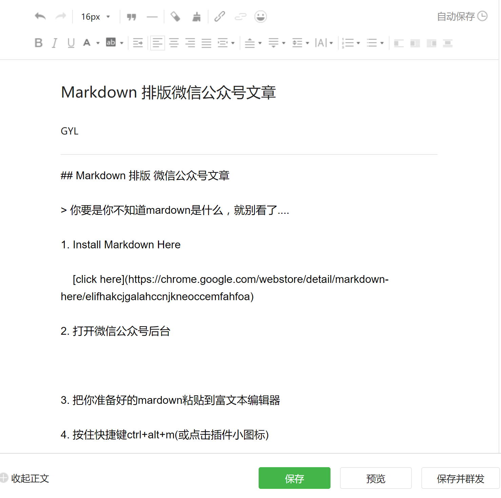
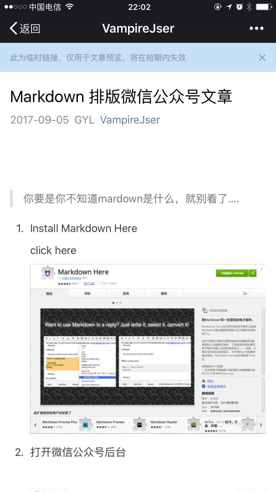

## Markdown 排版 微信公众号文章

> 你要是不知道mardown是什么，就别看了....

1. Install Markdown Here

    [click here](https://chrome.google.com/webstore/detail/markdown-here/elifhakcjgalahccnjkneoccemfahfoa)

    

2. 打开微信公众号后台

    

3. 把你准备好的markdown粘贴到富文本编辑器

    

4. 按住快捷键ctrl+alt+m(或点击插件小图标)

    自动生成富文本

    

5. 预览

    
