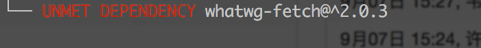
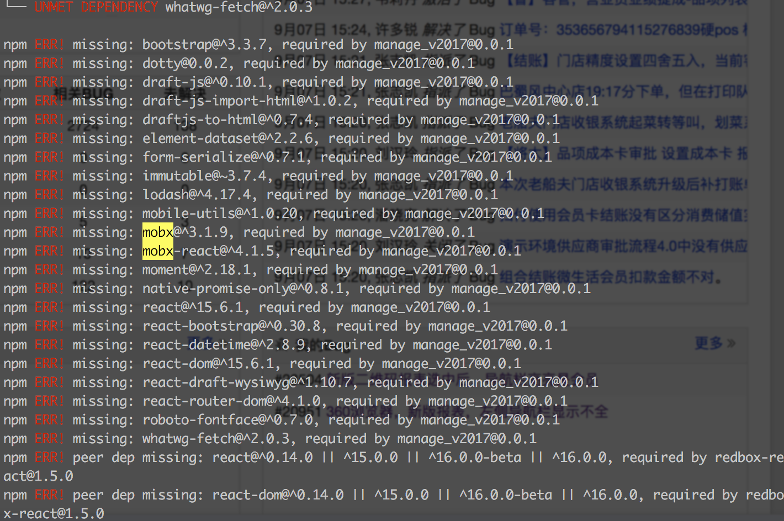

## NPM UNMET DEPENDENCY 的解决方案

> 今天工作的时候，更新了一下项目，npm install 时瞬间懵逼~~~



安装中一直出现这种情况，会卡壳，so...

### 解决方式

- 删除清缓存

    ```js
    rm -rf node_modules/    # 删除已安装的模块
    npm cache clean         # 清除 npm 内部缓存
    npm install             # 重新安装
    ```

- 删除升级npm

    ```js
    rm -rf node_modules/    # 删除已安装的模块
    sudo npm update -g npm  # 更新 npm
    npm install             # 重新安装
    ```

- npm list 查看确实目录手动安装

    

    少量还可以，多的话，就爽歪歪了
