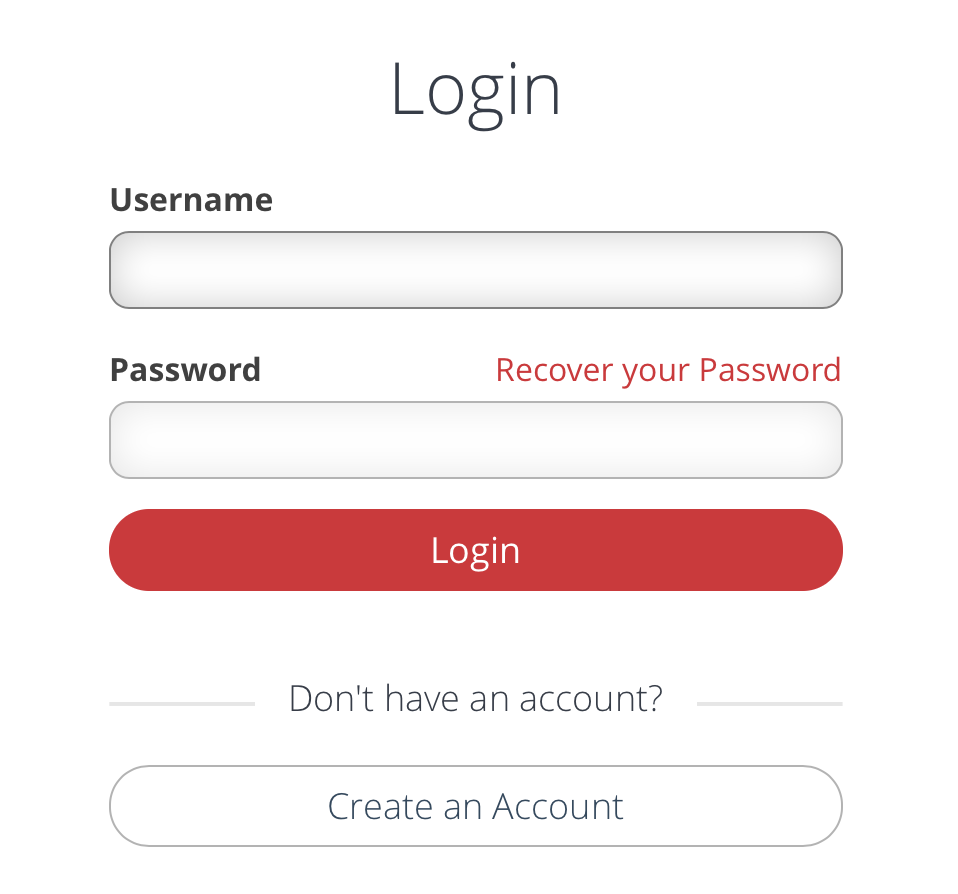
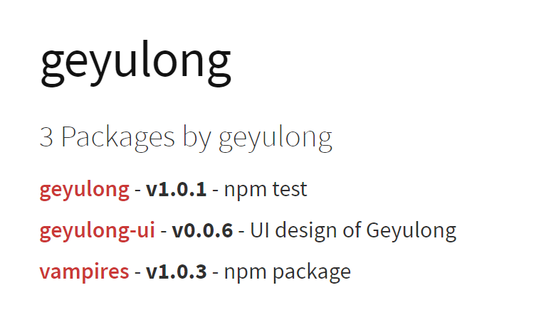

## How to create and publish your npm package ?

### npm
> npm is the package manager for javascript

> NPM(Node Package Manager)本来是Node.js的包管理工具,但随着JS这几年的蓬勃发展,现在npm已经成为了几乎所有跟JS相关的工具和软件包的管理工具,并且还在不断的发展完善中.现在最新版的Node.js的安装都会自带npm,装上Node.js就可以使用npm

#### npm command

```shell
#显示npm版本
npm -v

#安装npm包，全局安装加入-g参数
npm install demo [-g]

#列出安装模块,列出全局模块加入-g参数
npm list [-g]

#卸载模块
npm uninstall demo [-g]

#升级模块，升级当前目录下项目的所有模块：npm update.
npm update demo [-g]

#显示模块详情
npm show demo

# 初始化一个node项目目录(引导用户创建package.json,package中包含项目名称，版本，作者，git仓库地址)，默认交互模式，加入-y参数进入非交互模式
npm init [-y]
```

#### create npm package

> 简单实例

```js
//创建一个node模块
npm init

//目录结构

├ vampires
    ├ src
        ├ index.js
    ├ index.js
    ├ package
    ├ README.md

//src/index.js: ...code...
module.exports = function() {
    console.log('welcome to vampires!');
    return "vampires";
}

//index.js: ...code...
var vampire = require('./src/index');

```

#### publish npm package

首先注册一个npm账户



```shell
#在本地添加账户
npm adduser

#发布(同一个版本号不能重复发布)
npm publish
```

#### use

```js
var vampires = require("vampires");

var demo = vampires();
console.log(demo, 'demo');

//welcome to vampires!
//vampires
```

#### 查看自己npm列表




